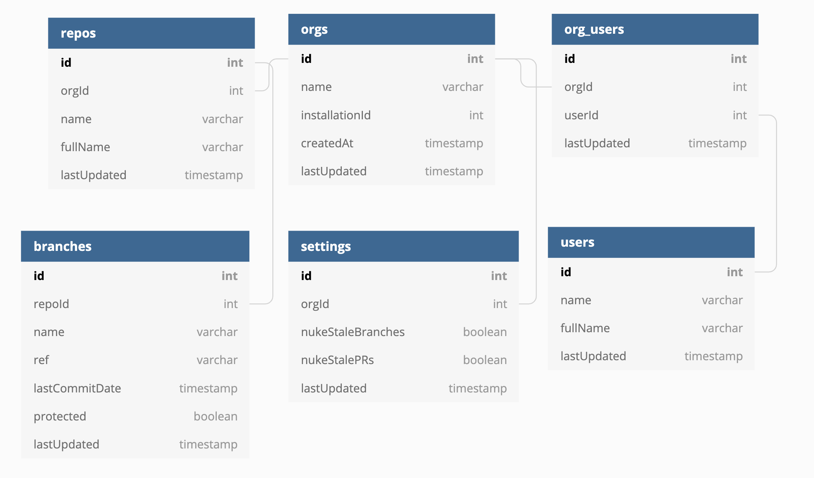

# dl-database-api

Currently, I'm using this repository to manage the graphql endpoints of the main database.  It relies on Sequelize to
run the migrations + seed data, and postgraphile to automatically generate all the endpoints needed.

## ER Diagram

https://dbdiagram.io/d/5db78492fa792a62f50d9999

## Creating Models
Here's what I used to generate the base models (did NOT include references etc.)
```bash
#!/bin/bash
sequelize model:generate --name Org --attributes name:STRING,installationId:INTEGER --force
sequelize model:generate --name OrgUser --attributes orgId:INTEGER,userId:INTEGER  --force
sequelize model:generate --name User --attributes name:STRING,fullName:STRING --force
sequelize model:generate --name Repo --attributes name:STRING,orgId:INTEGER,fullName:STRING --force
sequelize model:generate --name Branch --attributes name:STRING,repoId:INTEGER,lastCommitDate:DATE,protected:BOOLEAN --force
```

## Creating Seed Data
```bash
npx sequelize-cli seed:generate --name demo-branches
```

## Connection Strings
I use dotenv to provide the connection data with the following environment variables:
- DB_USERNAME
- DB_PASSWORD
- DB_DATABASE
- DB_HOST

As of now, I am using Postgres 12 for the DB.

## More Information
https://www.graphile.org/postgraphile/

## To lint and prettify
```bash
eslint --ignore-path .gitignore .
prettier --write "**/*.js"
```
